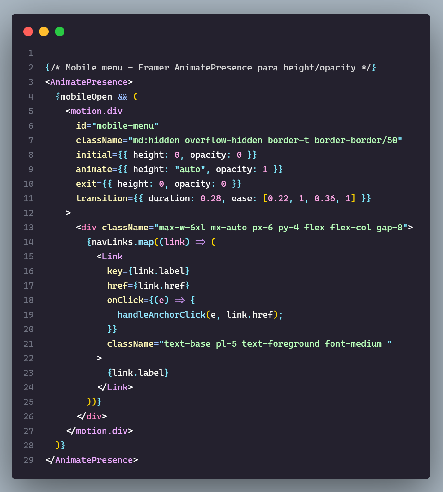
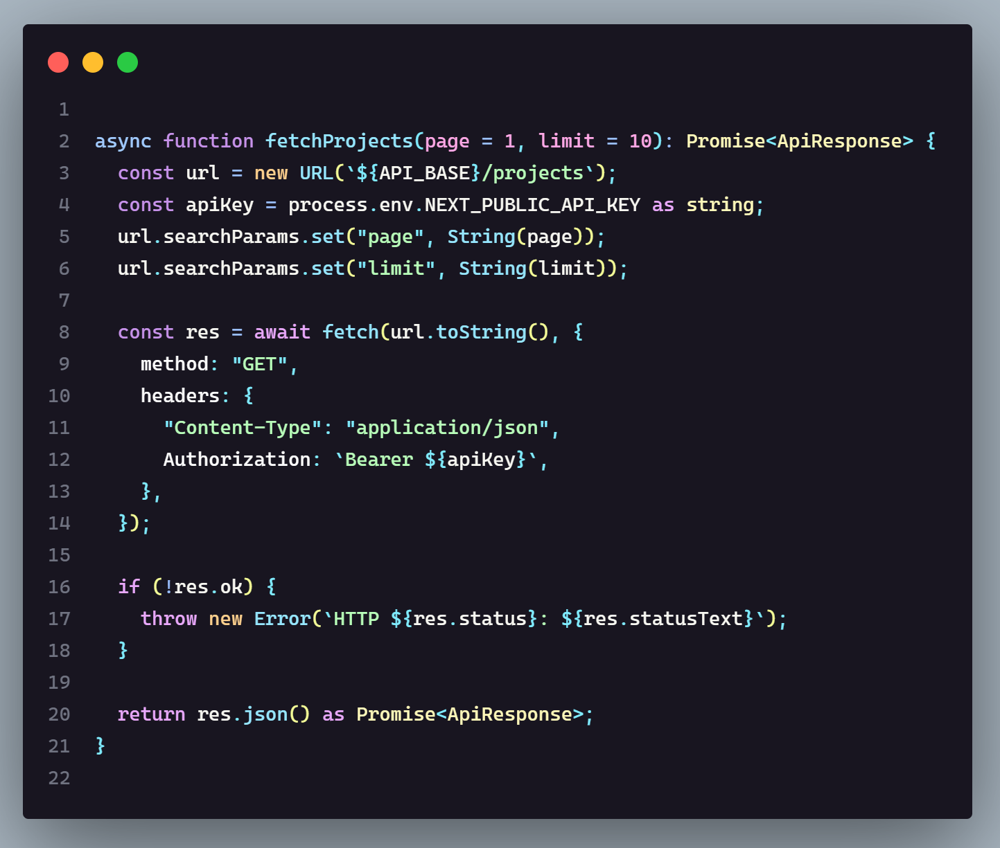

# Funky Theme 👻

> A vibrant, semantically-driven dark theme for Visual Studio Code — breaking away from the usual dull dark themes.

As terminal agents and AI handle more of the heavy lifting, the IDE is becoming less of a place to write everything and more of a place to review, understand, and refine. Funky Theme embraces that shift with bright, vibrant semantics — because if you're going to look at code, it shouldn't have to look dull.

**Get it on the [VS Code Marketplace](https://marketplace.visualstudio.com/items?itemName=MaxGB23.funky-theme-vscode) · [Open VSX](https://open-vsx.org/extension/MaxGB23/funky-theme-vscode).**

---

## Screenshots

<p align="center"><strong>Funky Dark</strong></p>

<p align="center">
  
</p>

<p align="center"><strong>Funky Darker</strong></p>

<p align="center">
  
</p>

---

## Color Philosophy

Funky Theme is built around a **semantic, tiered color palette** defined in a single source-of-truth config file. Every color has a name and a reason to exist:

- 🩷 **Pinks** — Tags, parameters, numeric constants
- 🟣 **Purples** — Keywords, math/logic operators, support classes (flow keywords in a lighter purple)
- 🩵 **Cyans** — Functions, attributes, regex, escape characters
- 🔵 **Blues** — Methods, symbol operators, storage modifier
- 🟡 **Yellows** — Class names, type names, attribute names
- 🟢 **Greens** — Strings, git untracked, inline code
- 🔴 **Reds** — Errors, variables, deleted references
- 🟠 **Oranges** — Warnings, HTML attributes, operator accents

---

## Variants

| Variant                 | Description                                                                                                                                                     |
| ----------------------- | --------------------------------------------------------------------------------------------------------------------------------------------------------------- |
| **Funky Dark**          | The main experience. Balanced contrast, vivid palette.                                                                                                          |
| **Funky Dark Italic**   | The full cursive treatment — control flow, storage types and metadata in italic, zero bold in code. For fans of italic-capable fonts like Operator Mono.       |
| **Funky Dark Mix**      | A directed typography strategy: bold on declaration names, italic on metadata, everything else regular. An anti-eye-fatigue balance.                          |
| **Funky Darker**        | Ultra-nocturnal backgrounds for zero-distraction sessions.                                                                                                      |
| **Funky High Contrast** | Accessibility-focused borders and boosted contrast for comment tokens.                                                                                          |

### Why five variants?

Different developers read code differently. Some want pure color, some want deep night, some need accessibility, some love cursive, and some want typography that works *with* their eyes instead of against them. Funky Theme ships five variants so each of those profiles gets a first-class experience instead of a compromise — and every variant inherits the same palette, so switching between them changes the *experience*, never the meaning of a color.

Two things make this lineup original:

- **One italic layer, two personalities.** Dark Mix and Dark Italic share the exact same metadata-italic foundation (comments, parameters, attributes, language variables, aliases). Mix then adds bold on declaration names — functions, classes, types — marking *where things are defined* so definitions stand out from plain calls; Italic extends the cursive to control flow (`if`, `return`, `for`…) and storage types (`function`, `class`, `const`…). The variants complement each other instead of duplicating.
- **Controversial aesthetics live in their own variant.** Keyword italics are among the most toggled-off styles in VS Code history — so instead of forcing them on everyone, they live isolated in Funky Dark Italic. Dark, Darker and High Contrast stay completely typography-free, and even Mix — which does use bold and italics — deliberately never touches keywords. Only what nobody defends — italics on numbers — is left out everywhere.

---

## Language Support

While primarily dedicated to and optimized for **web development** (specifically for workflows using **React, HTML, CSS, JavaScript, TypeScript, Next.js, and Markdown**), it has also been tested and tuned for other languages:

- **JavaScript** (includes Node.js/Express)
- **TypeScript / TSX**
- **HTML**
- **CSS / SCSS**
- **C**
- **C++**
- **C#**
- **Go**
- **Java**
- **PHP**
- **Python**
- **Rust**
- **Markdown, JSON / JSON5 & Regular Expressions** — formats and utilities with dedicated rules

---

## Terminals

The integrated editor terminal already ships with Funky Theme's ANSI palette — no extra setup required, and it works across shells such as Bash, Zsh, PowerShell, and others. The palette is most noticeable in shells and CLI tools that make extensive use of colored output.

### Terminal-based AI Agents (WIP)

A standalone terminal palette for AI coding agents such as OpenCode and Pi is in the works, with two planned variants: Funky Dark and Funky Darker. Both are derived from the same source of truth as the editor theme, while allowing for small adjustments where terminal environments differ from the IDE. The standard variant may also use minimal italics where they improve readability, without introducing a separate italic variant. This keeps your terminal environment visually consistent without requiring a separate palette to maintain.

> **Status:** WIP — still debating packaging and whether it ships in this repo or a separate one.

---

## Recommended editor settings

Funky Theme is tested and tuned against the following editor settings. They are **recommended, not required** — the theme works with any font and spacing, but this is the setup it was designed and validated with:

```json
{
  "editor.fontFamily": "Cascadia Code, monospace",
  "editor.fontLigatures": true,
  "editor.lineHeight": 23,
  "editor.tabSize": 2,
  "editor.fontSize": 14
}
```

> `editor.lineHeight` works anywhere from **23 to 25** — pick what feels comfortable.
>
> **Note**: Cascadia Code isn't bundled with Funky Theme. If it isn't installed on your system, VS Code falls back to a system monospace font.

---

## 📦 Installation

Funky Theme is available on both major VS Code-compatible registries — the **VS Code Marketplace** and **Open VSX** — plus the GitHub Releases `.vsix` for anything else. Pick the path that fits your editor.

### Option A: VS Code Marketplace (Recommended)

Get it directly: **[VS Code Marketplace](https://marketplace.visualstudio.com/items?itemName=MaxGB23.funky-theme-vscode)** — or follow the steps below.

1. Open the **Extensions** view (`Ctrl+Shift+X` on Windows/Linux or `Cmd+Shift+X` on Mac).
2. Search for **"Funky Theme"** — extension ID: `MaxGB23.funky-theme-vscode`.
3. Click **Install**.
4. Open the Command Palette (`Ctrl+Shift+P` on Windows/Linux or `Cmd+Shift+P` on Mac), run **`Preferences: Color Theme`**, and select your favorite **Funky** variant.

### Option B: Open VSX (VS Code-compatible editors)

Get it directly: **[Open VSX](https://open-vsx.org/extension/MaxGB23/funky-theme-vscode)** — the open-source registry used by VS Code-compatible editors that cannot use the Microsoft Marketplace (Microsoft's ToS restricts forks): **VSCodium** (default gallery), **Google Antigravity** (default marketplace), **Cursor** (served through Cursor's own marketplace proxy), **Windsurf / Devin Desktop**, **AWS Kiro**, **Gitpod** (browser) and **Eclipse Theia**. In any of these, just open the editor's **Extensions** panel and search for **"Funky Theme"** — then pick a Funky variant via `Preferences: Color Theme`.

### Option C: GitHub Releases (direct .vsix)

Prefer sideloading? Download the latest `.vsix` file from the [Releases](https://github.com/maxgb23/funky-theme/releases) page and install it directly:

1. Open the Command Palette (`Ctrl+Shift+P` on Windows/Linux or `Cmd+Shift+P` on Mac).
2. Type and select **`Extensions: Install from VSIX...`**.
3. Browse and select the downloaded `.vsix` file.
4. Open the Command Palette again, run **`Preferences: Color Theme`**, and select your favorite **Funky** variant.

Or install it via CLI:

```bash
code --install-extension path/to/funky-theme-vscode-x.x.x.vsix
```

> *Note: Replace `code` with your editor's CLI command if you are not using VS Code, e.g., `cursor --install-extension ...`, `codium --install-extension ...` (VSCodium), or `antigravity --install-extension ...` (Google Antigravity).*

---

## Build from source

> **Note**: You can use `npm` to install dependencies and run scripts, but **`pnpm` is highly recommended** for better security, stricter dependency resolution, and to avoid lockfile conflicts.

```bash
# Clone the repo
git clone https://github.com/maxgb23/funky-theme
cd funky-theme

# Install dependencies
pnpm install

# Compile the theme JSON files
pnpm build

# Generate the .vsix package
pnpm package
```

---

## Maintenance & Contributing

Want to tweak colors, add new tokens, or build your own variant on top of Funky Theme?

👉 Read the **[Guía de Mantenimiento](./docs/how-to-modify-theme.md)** — a step-by-step guide covering the architecture, how to modify existing colors, and how to add new palette tokens.

> The guide is written in Spanish, as most contributors and maintainers of this project are Spanish-speaking developers.

---

## License

[MIT](./LICENSE) © maxgb23
